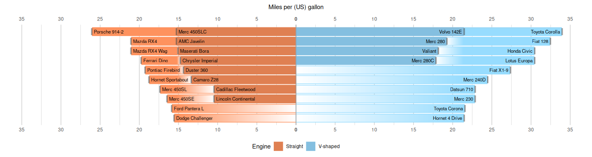

---
output:
  html_document: default
  pdf_document: default
---

<!-- README.md is generated from README.Rmd. Please edit that file -->

# ggpile

<!-- badges: start -->

<!-- badges: end -->

The goal of ggpile is to make piled bar charts easy with ggplot2.

## Installation

You can install the development version of ggpile like so:

``` r
pak::pak("hrryt/ggpile")
```

## Example

This is an example which shows you how to make a piled bar chart:

``` r
library(ggplot2)
library(ggpile)

ggplot(mtcars, aes(mpg, label = row.names(mtcars), mirror = !vs)) +

  geom_col_pile(width = 0.85) +
  geom_vline(colour = "grey60", xintercept = 0) +
  geom_text(
    aes(x = mpg - 0.2), stat = "pile",
    colour = "black", hjust = "inward", size = 3
  ) +

  scale_x_continuous(
    name = "Miles per (US) gallon\n",
    breaks = scales::breaks_width(5),
    labels = ~ replace(abs(.x), .x == 0, expression(bold("0"))),
    limits = c(-34, 34),
    position = "top",
    sec.axis = dup_axis(name = NULL)
  ) +

  scale_y_discrete(breaks = NULL, expand = expansion(add = 0.3)) +

  scale_fill_manual(
    name = "Engine",
    aesthetics = c("colour", "fill"),
    breaks = c("-1", "1"),
    labels = c("Straight", "V-shaped"),
    values = c(
      "-2" = "#fe925e",
      "-1" = "#df8052",
       "1" = "#84bfe0",
       "2" = "#97dcfe"
    ),
    guide = guide_legend(position = "bottom")
  ) +

  theme_minimal() +
  theme(panel.grid = element_line(colour = "grey80"))
```


